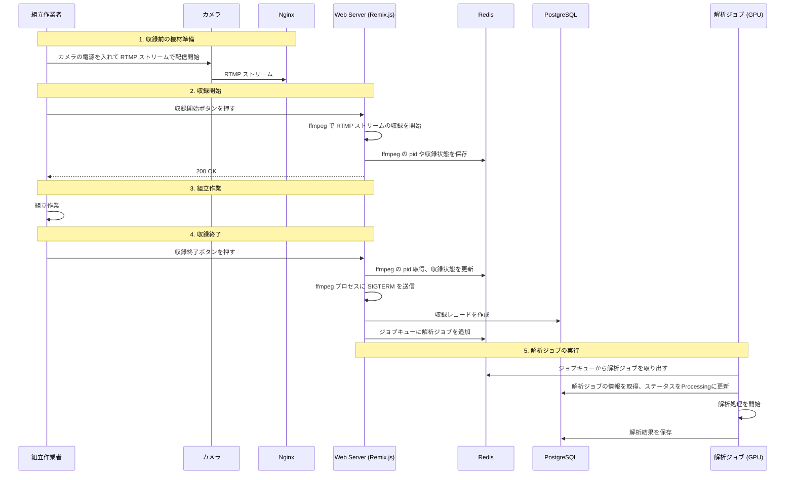

# System flow

以下のシーケンス図は組立作業の収録の開始から終了、解析までの一部始終の流れを示す。

```mermaid
sequenceDiagram
    participant U as 組立作業者
    participant C as カメラ
    participant N as Nginx
    participant W as Web Server (Remix.js)
    participant R as Redis
    participant D as PostgreSQL
    participant J as 解析ジョブ (GPU)

    Note over U,N: 1. 収録前の機材準備
    U->>C: カメラの電源を入れて RTMP ストリームで配信開始
    C->>N: RTMP ストリーム

    Note over U,W: 2. 収録開始
    U->>W: 収録開始ボタンを押す
    W->>W: ffmpeg で RTMP ストリームの収録を開始
    W->>R: ffmpeg の pid や収録状態を保存
    W-->>U: 200 OK

    Note over U,W: 3. 組立作業
    U->>U: 組立作業

    Note over U,W: 4. 収録終了
    U->>W: 収録終了ボタンを押す
    W->>R: ffmpeg の pid 取得、収録状態を更新
    W->>W: ffmpeg プロセスに SIGTERM を送信
    W->>D: 収録レコードを作成
    W->>R: ジョブキューに解析ジョブを追加

    Note over W,J: 5. 解析ジョブの実行
    J->>R: ジョブキューから解析ジョブを取り出す
    J->>D: 解析ジョブの情報を取得、ステータスをProcessingに更新
    J->>J: 解析処理を開始
    J->>D: 解析結果を保存
```
